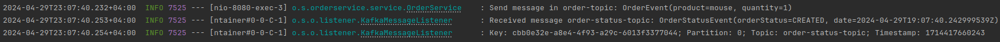
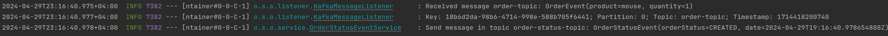

## Практическая работа №6
# Курса «Разработка на Spring Framework» от компании Skillbox. «Пример интеграции с брокером сообщений Apache Kafka»
## Цель практической работы
Закрепить знания, полученные по следующим темам:
<ol>
<li>Настройка Kafka в приложениях.</li>
<li>Отправка сообщений в Kafka.</li>
<li>Принятие и обработка сообщений от Kafka.</li>
</ol>

## Сделано
Создано два приложения:

1. Приложение order-service, по получению Post-запрос с сущностью Order,
```http request
http://localhost:8080/api/order
```
```json body request
{
    "product" : "name",
    "quantity" : 1
}
```
отправляет в Kafka событие OrderEvent, топик order-topic. А также слушает события по топику order-status-topic, при возникновении события 
выводит в виде лога это сообщение.



2. Приложение order-status-event слушает топик order-topic, при появлении сообщения принимает его и обрабатывает, и отравляет сообщение в топик order-status-event,
которое содержит статус и время заказа (order).



## До запуска приложений

Необходимо запустить docker-compose.
```
~/KafkaTranning/docker$ docker-compose up
```